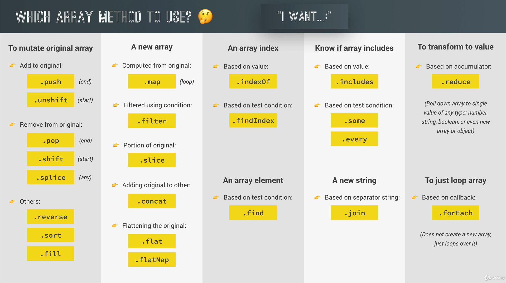

# ARRAYS

The JavaScript **Array** class is a global object that is used in the construction of arrays; which are high-level, list-like objects.



## Common Methods

- **push** : Add an item to the end of an Array

  ```javascript
  let fruits = ['Apple', 'Banana'];
  let newLength = fruits.push('Orange'); // ["Apple", "Banana", "Orange"]
  ```

- **pop** : Remove an item from the end of an Array

  ```javascript
  let last = fruits.pop(); // remove Orange (from the end)  let newLength = fruits.push('Orange');
  // ["Apple", "Banana"]
  ```

- **shift** : Remove an item from the beginning of an Array

  ```javascript
  let first = fruits.shift(); // remove Apple from the front
  // ["Banana"]
  ```

- **unshift** : Add an item to the beginning of an Array

  ```javascript
  let newLength = fruits.unshift('Strawberry'); // add to the front
  // ["Strawberry", "Banana"]
  ```

- **splice** : Remove an item by index position

  ```javascript
  fruits.push('Mango');
  // ["Strawberry", "Banana", "Mango"]
  let pos = fruits.indexOf('Banana');
  // 1
  let removedItem = fruits.splice(pos, 1); // this is how to remove an item
  // ["Strawberry", "Mango"]
  ```

- **slice**: shallow copy an Array. Can also be used to get the sub array.
  range : [start, end) : start inclusive and end not inclusive
  if the values are negative that means staring from last
  [more](https://developer.mozilla.org/en-US/docs/Web/JavaScript/Reference/Global_Objects/Array/slice)

  ```javascript
  let shallowCopy = fruits.slice(); // this is how to make a copy
  // ["Strawberry", "Mango"]
  let lastElement = fruits.slice(-1);
  // Mango
  ```

- **concat** : add elements of one array to another and creates a new array [more](https://developer.mozilla.org/en-US/docs/Web/JavaScript/Reference/Global_Objects/Array/concat)
  ```javascript
  const array1 = ['a', 'b', 'c'];
  const array2 = ['d', 'e', 'f'];
  const array3 = array1.concat(array2);
  // expected output: Array ["a", "b", "c", "d", "e", "f"]
  ```
- **reverse** : reverse the array. **Careful**: reverse is destructive -- it changes the original array. [more](https://developer.mozilla.org/en-US/docs/Web/JavaScript/Reference/Global_Objects/Array/reverse)

  ```javascript
  const array1 = ['one', 'two', 'three'];
  console.log('array1:', array1);
  // expected output: "array1:" Array ["one", "two", "three"]

  const reversed = array1.reverse();
  console.log('reversed:', reversed);
  // expected output: "reversed:" Array ["three", "two", "one"]

  // Careful: reverse is destructive -- it changes the original array.
  console.log('array1:', array1);
  // expected output: "array1:" Array ["three", "two", "one"]
  ```
