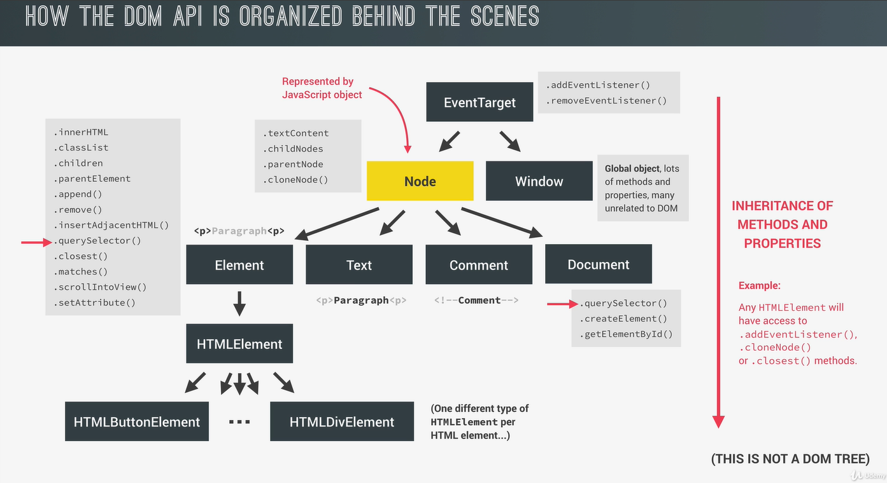

# DOM

The **Document Object Model (DOM)** connects web pages to scripts or programming languages by representing the structure of a document—such as the HTML representing a web page—in memory. Usually, that means JavaScript, although modeling HTML, SVG, or XML documents as objects are not part of the core JavaScript language, as such.

The DOM represents a document with a logical tree. Each branch of the tree ends in a node, and each node contains objects. DOM methods allow programmatic access to the tree. With them, you can change the document's structure, style, or content.

## NOTES

- DOM is the interface between javascript and the browser, more specifically the HTML and CSS rendered in the browser.
- DOM tree is generated form any HTML document, which we can interact with from javascript using the DOM APIs.
- In DOM there are different types of nodes.
- Every nodes in a DOM tree is a Node represented as javascript object, which has access to special node methods and properties such as
  - textContent
  - childNodes
  - parentNodes
  - cloneNodes() ...
- The Nodes has different types
  - Element
  - Text
  - Comment
  - Document

